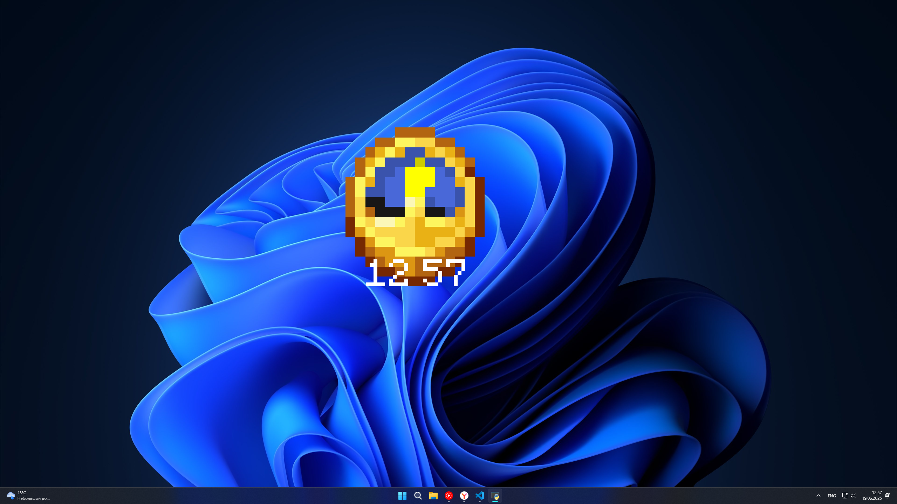

# Minecraft Clock on Your Desktop!

This unique program brings the iconic Minecraft clock to your desktop as a fully functional and interactive widget!

  

Don't worry about messy code – this was all in good fun! Built using Python and Pygame (SDL2).

  

## Features:

*   **Drag and Drop:** Move the clock widget around your desktop (unless it's locked!).
*   **Resize:** Use the mouse wheel to adjust the clock's size to your liking.

## Hotkeys:

*   `Ctrl + F`: Recenter the widget if you lose track of it.
*   `Ctrl + L`: Lock the widget's position and size. This disables dragging and resizing.
*   `Ctrl + T`: Switches widget mode over windows.
*   `Ctrl + escape`: Closes the widget.

## Debug Mode (requires `debug: true` in `config.json`):

*   `Ctrl + P`: Display the current FPS (frames per second) in the bottom-left corner of the screen.
*   `Ctrl + H`: Show the clock widget's hitbox for debugging collision issues.

## Configuration:

Further customization is available by editing the `config.json` file. If you accidentally corrupt the config file, simply delete it, and a new one will be automatically generated.

## Perfomance

For the best experience, it is recommended to set the frame rate (FPS) to 24-30. Yes this is python baby!

## Compatbility

**Platform:** Windows 7+ (Tested on Windows 11)

**Notes:** This program was developed and tested on Windows 11. However, it is expected to be compatible with all versions of Windows starting from Windows 7 and up. Installing additional libraries or components might be required for proper functionality on older Windows versions.

Enjoy your new Minecraft Clock!